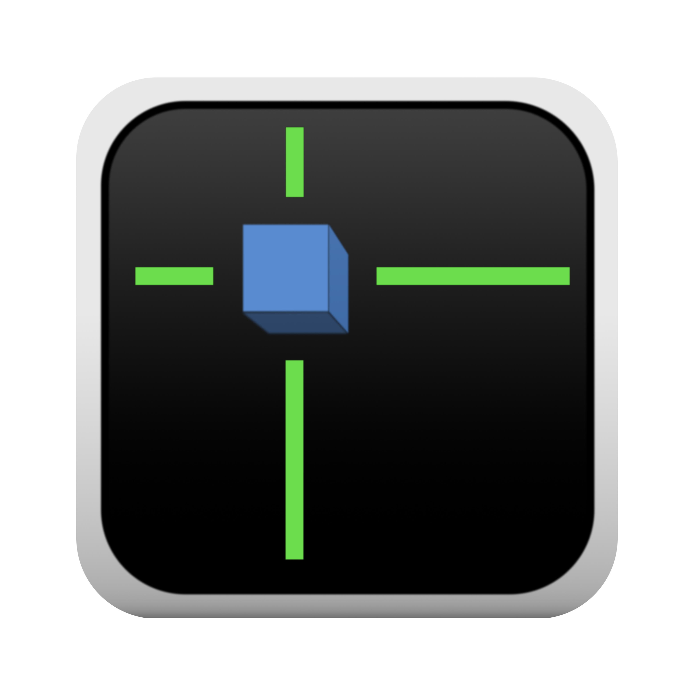
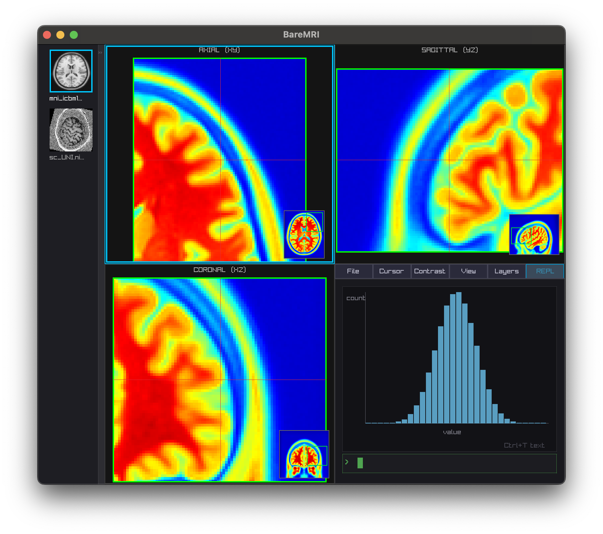

# VoxelBase 

Tiny C99 NIfTI viewer built on raylib + raygui. Fast inspection, teaching, and hacking. Not clinically validated.

Tri-view display (axial / sagittal / coronal), 4D timeseries with scrub + chart, contrast sliders, overlay + segmentation support with per-layer opacity/threshold, zoom to crosshair, 5 colormaps, PNG screenshot export.



## Build

```sh
make                  # dynamic link (needs raylib installed via pkg-config)
make STATIC=1         # fully static binary (bundles libraylib.a)
make app              # macOS .app bundle with Dock icon
make install          # install to /Applications + /usr/local/bin/baremri
```

Requires: **raylib 5.5**, **OpenBLAS** (or Accelerate on macOS), **zlib**.

## Usage

```
baremri [options] <file1.nii> [file2.nii ...]

Options:
  --out <dir>           Screenshot output directory
  -s, --seg <seg.nii>   Segmentation overlay
  -o, --overlay <ovl>   Statistical overlay
  -p, --profile <WxH>   Window size (default: 1200x800)
  -h, --help            Show this help
```

## Features

### Multi-Image
Drag-drop `.nii` / `.nii.gz` files or pass multiple on the command line. Up to 10 slots. Sidebar with thumbnails — click to switch, drag to reorder, right-click to delete. Per-slot zoom sync (Z) and crosshair sync (X).

### Layers Panel
Photoshop-style layers. Each overlay/segmentation has independent opacity and threshold. Segmentations auto-detect labels (sampled ~50k voxels) with per-label visibility toggles.

### REPL / VBL Language
Tab 6 is a full VBL REPL with syntax highlighting and ghost-text autocomplete. VBL is a typed S-expression language for image computation:

```clojure
(slot 0)                ;; copy slot 0 into VBL Value
(def brain (slot 0))    ;; bind to name
(print brain)           ;; inspect

(smooth brain 2.0)      ;; Gaussian smooth (FWHM in voxels)
(mean brain)            ;; scalar mean
(stdev brain)           ;; scalar stdev
(crop brain 10 50 10 50 0 30)  ;; crop to bounding box

(show (smooth brain 1.5))  ;; push result as new slot
(save brain "/tmp/out.nii") ;; save to file

;; stats: mean tmean stdev min max sum tstd
;; spatial: smooth crop pad
;; signal: bandpass detrend threshold mask
;; correlation: seed correlate
;; arithmetic: + - * / bc+ bc- bc* bc/
;; comparison: eq gt lt and or
;; views: slice tslice copy voxel
;; affine: affine translate rotate scale apply
;; constructors: vol3d vol4d noise
;; plots: plot-line plot-hist

(help)              ;; list all ops by category
(help vol3d)        ;; show all ops for vol3d type
(help smooth)       ;; show smooth signature + description
```

**Keyboard shortcuts in REPL:**
| Key | Action |
|-----|--------|
| Tab | Accept ghost-text completion |
| Ctrl+A / Ctrl+E | Beginning / end of line |
| Ctrl+W | Delete word backward |
| Ctrl+U | Delete to start of line |
| Ctrl+T | Toggle canvas / text mode |
| Cmd+V / Ctrl+V | Paste from clipboard |

### Canvas Plotting
Ctrl+T toggles between text output and a plotting canvas:
```clojure
(plot-line (slot 0))        ;; line + scatter of slot data
(plot-line xs ys)            ;; XY plot
(plot-hist data 20)          ;; histogram with 20 bins
(clear)                      ;; clear output + plots
```

### Viewport Controls
| Key | Action |
|-----|--------|
| Arrows | Move crosshair (Shift = 5× step) |
| Page Up/Down | Move through slices |
| Tab | Cycle axial → sagittal → coronal focus |
| X | Toggle crosshair sync |
| Z | Toggle zoom sync |
| [ / ] | Zoom out / in |
| 0 | Reset zoom |
| 1-9 | Switch to slot |
| S | Screenshot to output dir |

### Colormaps
Gray, Hot, Jet, Bone, Coolwarm — selectable in the Contrast tab per slot.

### Drag-Drop
Click **+Seg** or **+Ovl** in the Layers tab, then drop a `.nii` file to attach it. Drop directly onto the window to load as a new slot.

## Architecture

```
src/
├── main.c              # entry point, window loop, buffer management
├── app.h               # App, ImageSlot, Attachment structs
├── cli/                # command-line parsing
├── load/               # NIfTI loading, volume conversion
├── extract/            # slice + timeseries extraction
├── render/             # GPU texture upload, colormap application
├── ui/
│   ├── panel.c         # tabbed panel (File, Cursor, Contrast, View, Layers, REPL)
│   ├── sidebar.c       # slot thumbnails, drag-reorder, context menus
│   └── viewport.c      # viewport click handling
├── input/
│   └── hotkeys.c       # keyboard + mouse wheel navigation
├── save/
│   └── screenshot.c    # PNG export
└── plugins/
    └── vbl/
        ├── vbl_bridge.c/h   # BareMRI ↔ VBL bridge (slot, show, plot ops)
        └── worker/          # VBL engine: parser, types, ops, graph, env, pool
```

Built on **raylib 5.5** + **raygui 5.0-dev** (vendored). NIfTI I/O via single-header C library. OpenBLAS for VBL compute ops.
